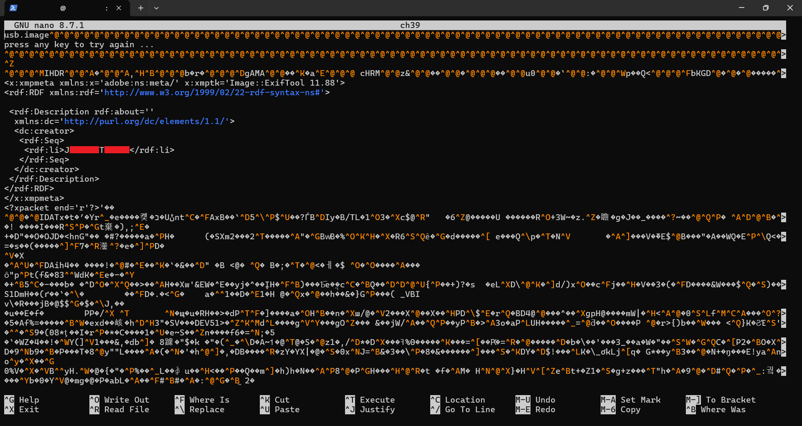

[Deleted File by Manah](https://www.root-me.org/en/Challenges/Forensic/Deleted-file)🔗

[🧩 Statement](#)

Your cousin found a USB drive in the library this morning.  
He’s not very good with computers, so he’s hoping you can find the owner of this stick!  
The flag is the owner’s identity in the form "firstname_lastname".  

[🔍 Initial Analysis](#)

After unzipping the archive, you obtain a file named "ch39".  
You can open it with Windows Notepad, but it appears to be slightly corrupted.  
Notepad experiences significant freezing when opening the file.

[💡 Hypothesis](#)

I guess that this file hides the name of the USB drive's owner.  
I didn't find anything else in the archive, and I checked for hidden files.

[🛠️ Exploitation](#)

I examinated the file "ch39" with Notepad and found something that looks like a name.



I entered the name in the correct format in the answer field, and it worked.  
After reviewing other solutions, I discovered that the USB drive also contained a hidden image.  
Based on this information, I used the following command:

```bash
foremost -i ch39
```

This resulted in the recovery of additional files:


I also attempted to extract the archive using WSL (Kali-Linux):

```bash
7z x ch39.gz
```

This produced the same file ("ch39"), which I opened with:

```bash
nano ch39
```

This time, no freezing occurred when using Nano.  
I also tried:

```bash
tar -xzf ch39.gz
```

Surprisingly this produced a different result, the file was named "usb.image",  
but opening it with nano produced the same result as "ch39".

[⚠️ Difficulties](#)

No significant difficulties were encountered.  
The challenge was solved in approximately 5 minutes.

[📚 Lessons Learned](#)

-Windows Notepad is not suitable for analyzing all file types.

-The way you unzip an archive can drastically change the result.  
Trying different methods is often useful and does not necessarily waste time.

Deleted data may still be recoverable. For truly sensitive data,  
physical destruction (e.g., a blender) remains the only reliable method.
