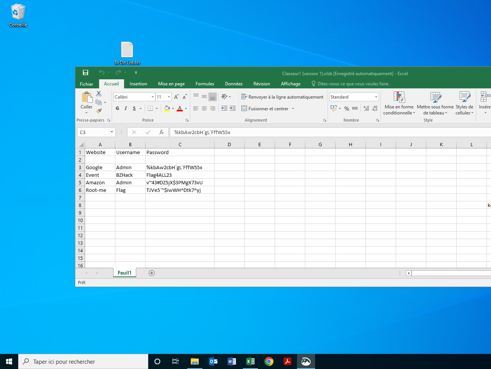

# [Capture this]([https://www.root-me.org](https://www.root-me.org/en/Challenges/Forensic/Capture-this))🔗

🔎 Category: Forensic 

🏆 Points: 15

🟡 Level: easy

👤 Author: Zey_Roxx

🗓️ Date: 20/10/2023

✅ Validating: 08/04/2026

## 🧩 Statement

An employee has lost his `KeePass` password. He couldn’t remember it, and couldn’t find his password file.  
After hours of searching, it turns out that he has sent a screen of his passwords to one of his colleagues,  
but it’s still nowhere to be found.

He’s asking for your help to find him.  
It’s up to you

## 🔍 Initial Analysis

The archive contains a file named `Database.kdbx`, it's can be open with `keePass`,  
and the file `Capture.png`, which look like this:  

This screenshot contains 4 passwords.

## 💡 Hypothesis

So I don't see anything suspicious one the screenshot, maybe the flag is just one of the 4 passwords.  
I think I'll just test these 4 

## 🛠️ Exploitation

## ⚠️ Difficulties

## 📚 Lessons Learned
