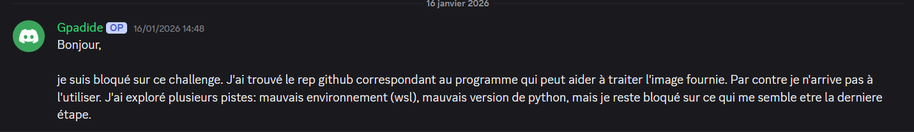
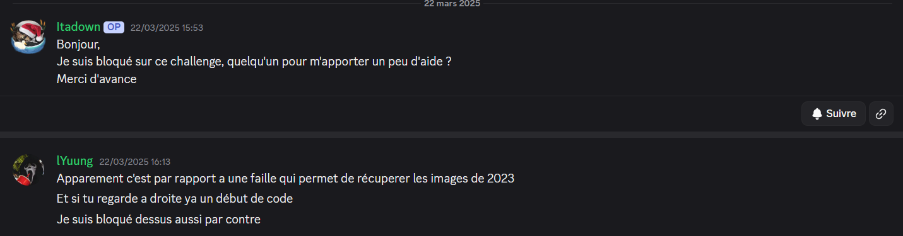
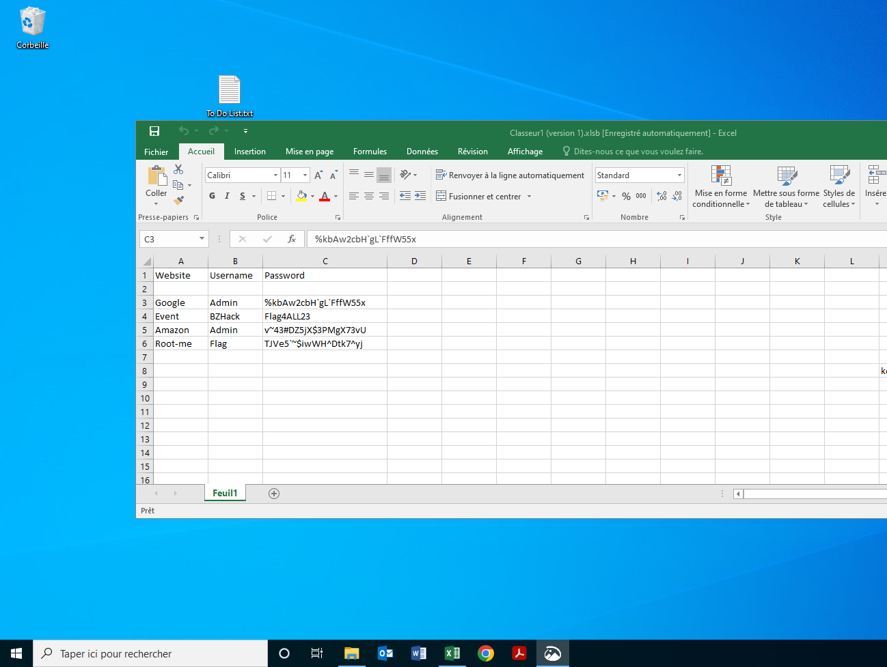
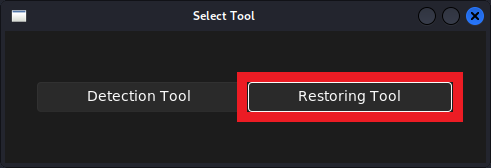
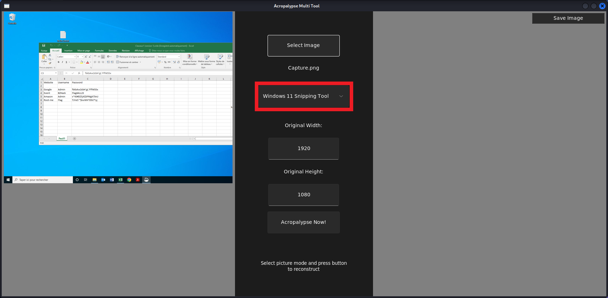
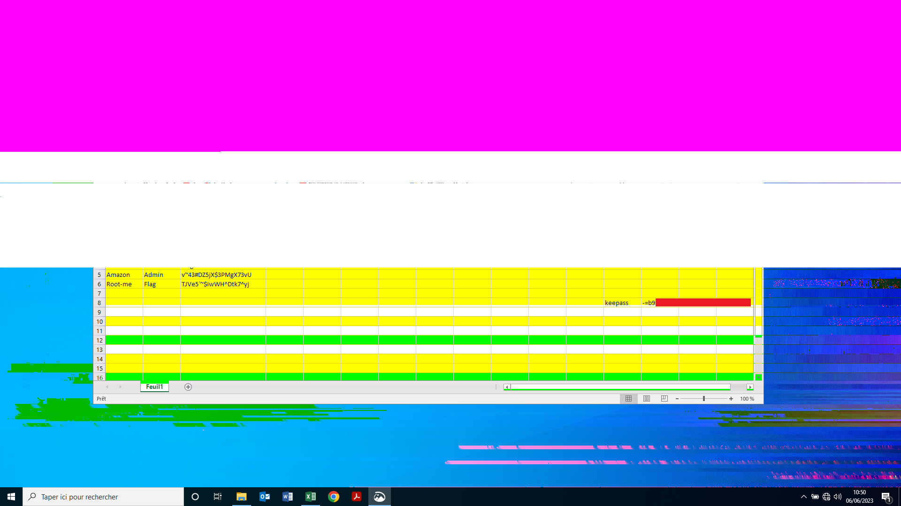
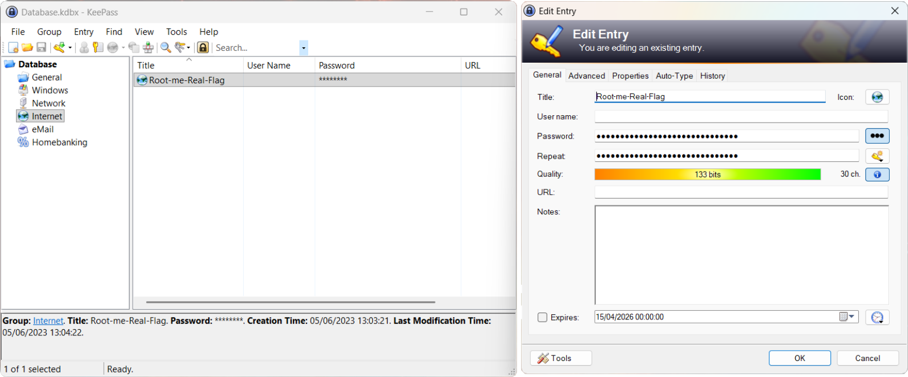

# [Capture this🔗](https://www.root-me.org/en/Challenges/Forensic/Capture-this)

<details>

🔎 Category: Forensic 

🏆 Points: 15

🟡 Level: easy

👤 Author: Zey_Roxx

🗓️ Date: 20/10/2023

✅ Validating: 08/04/2026

</details>

## 🧩 Statement

An employee has lost his `KeePass` password. He couldn’t remember it, and couldn’t find his password file.  
After hours of searching, it turns out that he has sent a screen of his passwords to one of his colleagues,  
but it’s still nowhere to be found.

He’s asking for your help to find him.  
It’s up to you

## 🔍 Initial Analysis

The archive contains a file named `Database.kdbx`, witch can be opened with `keePass`,  
and a file named `Capture.png`, which looks like this:  


This screenshot contains 4 passwords.

## 💡 Hypothesis

At first, nothing seems suspicious in the screenshot,  
The flag might simply be one of the four passwords, so I decided to test them.

## 🛠️ Exploitation

So we have 4 passwords to test in the keepass or directly in the answer field, obviously none of them works...  
However, I noticed a small fragment of a word on the right edge of the image.  
At this point, I was quite confused, how can you recover something that has been cropped !?

This made me think of something, sometimes when you crop an image, if you reopen it with the same editor you can see the hidden parts.  
So I tried opening it with the `Windows Snipping Tool` and using the crop function again, but nothing special happened.
I then checked the [Root-Me Discord server](https://discord.gg/rootme) and found some useful hints.



<details>
  <summary>translation</summary>

  *Hello,*
  
  *I’m stuck on this challenge. I found the GitHub repository corresponding to the program that can help process the provided image.*  
  *However, I’m unable to use it. I’ve explored several possibilities—incorrect environment (WSL),*  
  *wrong Python version—but I’m still stuck on what seems to be the final step.*

</details>



<details>
  <summary>translation</summary>

  **Itadown**

  *Hello,*  
  *I’m stuck on this challenge—could someone give me a bit of help?*  
  *Thanks in advance.*

  **lYuung**

  *Apparently it’s related to a vulnerability that allows retrieving images from 2023.*  
  *And if you look on the right, there’s the beginning of some code.*  
  *I’m stuck on it as well, though.*

</details>

After some research, it appears a vulnerability discovered in 2023 allows uncropping certain images.  
This vulnerability is known as `CVE-2023-21036`, commonly referred to as `Acropalypse`.  
It affects the `Windows Snipping Tool` and the `Google Pixel Screenshot Tool`.  
We need to find the `GitHub` repository, but first I will test something on the screenshot using this command:

```bash
grep -abo IEND Capture.png

>162160:IEND
>581412:IEND
```

<details>
  <summary>note</summary>

  When using `grep` on a binary file, the `-a` option is required.  
  The `-bo` options are used here to display offsets for easier reading.  

</details>

There should normally be only one `IEND` chunk in a `PNG` file.  
Having two clearly indicates that extra data is appended after the end of the image.   
I'll try something else and remove the extra data to see what happens:

```bash
dd if=003_ct.png of=clean.png bs=1 count=162172
file Clean.png
```

and we got this:



The result is the same visible image, but it now weighs `160 KB`, compared to `568 KB` for the original. The difference is huge!  
This confirms that a large amount of hidden data was appended.


Yes it the same image, but this one weidght `160 KB` the original weidght was `568 Kb`, the diferrence is so hudge !!!  
Next, I cloned the [Github repository](https://github.com/frankthetank-music/Acropalypse-Multi-Tool) related to the vulnerability.

I tried to run the `Python` program using `WSL Kali-Linux` but it displayed an `error` related to an "externally-managed-environment".  
I then tried using `Docker` but it didn’t work properly on `Windows` or `WSL Kali-Linux`,  
So I switched to `VMware`, but the image selector is broken...  
I also attempted to run it directly with `Python` but one of the dependencies does not support recent `Python` versions.  
As a last resort, I used `Pyenv` to create a `virtuel Python environement` and configured it with version `3.11.9`.  
Finaly we got this.




The result:



Now we can clearly see the missing part.  
First, enter the password in the answer field, then unlock the `KeePass` database to retrieve the real flag.



## ⚠️ Difficulties

At the beggining, I took ome time to find the right approach.  
hopefully the [Root-Me Discord server](https://discord.gg/rootme) gave me a clue,  
but the hardest part was using the tool, only one method in one environement actually worked.  
It was really frustratiing to have the solution in my hands but not be able to use it.

## 📚 Lessons Learned

