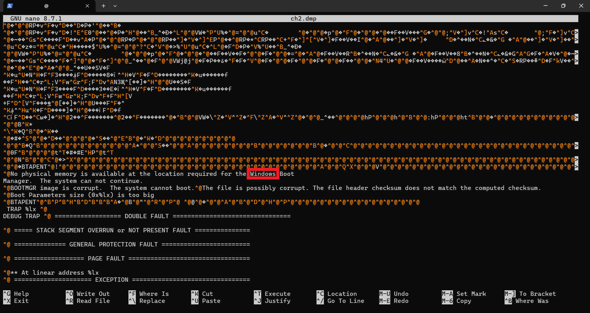
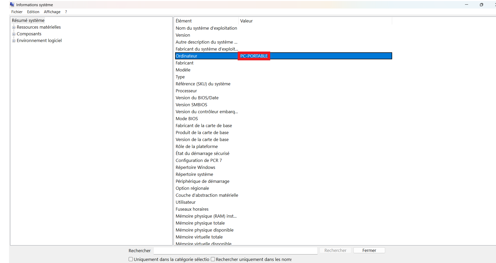
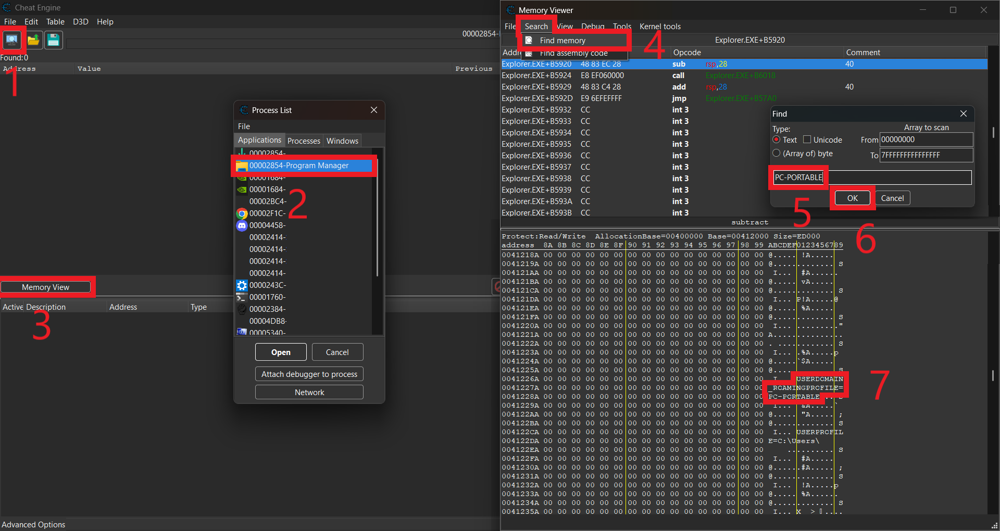
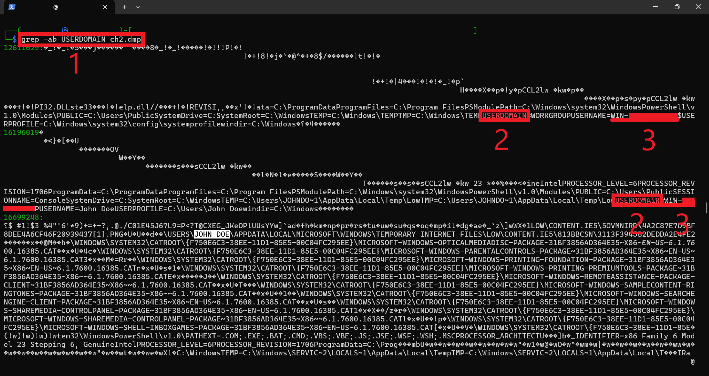

# [Command & Control - level 2🔗](https://www.root-me.org/en/Challenges/Forensic/Command-Control-level-2)

<details>

🔎 Category: Forensic

🏆 Points: 15

🟡 Level: Easy

👤 Author: Thanat0s

🗓️ Date: 16/02/2013

✅ Validating: 20/04/2026

</details>

## 🧩 Statement

Congratulations Berthier, thanks to your help the computer has been identified.  
You have requested a memory dump but before starting your analysis you wanted to take a look at the antivirus’ logs.  
Unfortunately, you forgot to write down the `workstation’s hostname`.  
But since you have its memory dump you should be able to get it back!

The validation flag is the workstation’s hostname.

## 🔍 Initial Analysis

The archive only contains a file naimed `ch2.dump`, the extension clearly indicates that the file is in `hexadecimal` format.  
This matches the statement, as a memory dump also called a `RAM` is typically analyzed in `hexadecimal`.

## 💡 Hypothesis

as far as I know, when an `hexadecimal` file contains `string` data, you can read it wuth any text editor,  
I'll use `nano` to try and find the flag. If we’re lucky, it might be near the beginning of the dump,  
similar to the [deleted file🔗](https://github.com/MINOTROCK/Root-Me/blob/main/write-ups/001_deleted_file_(df).md) CTF.

## 🛠️ Exploitation



I checked the beginning of the dump with `nano`, I didn't see anything looking like a `workstation’s hostname`,  
but I did confirm the operating system: `Windows`. Time for Plan B! 

The plan is simple, I'll use `CheatEngine` to see how information is stored in a `Windows` system's `RAM`.  
Since my own computer runs on `Windows`, I'll use it as a reference.    
First, let's check my own `workstation’s hostname`



Using `msinfo32.exe` , I can see that my `hostname` is `PC-PORTABLE`.  
Let’s search for this `string` in my `RAM` using `CheatEngine`.



Here is my strategy: a crucial program in `Windows`, is the `Program Manager`.  
The system cannot function without it, so the dump will definitely contain its active data.  
I searched for my `hostname` within the `Program Manager's` memory and—bingo!,  
I found that the `hostname` often appears right after the string `USERDOMAIN_ROAMINGPROFILE`.

Now, I just need to search for that keyword in the challenge dump using `grep`:

```bash
grep -ab USERDOMAIN ch2.dump
```



Look, the `workstation’s hostname` is here above the 3 on the screenshots., we also can see the username in white.

## ⚠️ Difficulties

No significant difficulties were encountered.    
The challenge was solved in approximately 10 minutes.

### 📚 Lessons Learned

- I learned how to navigate a raw memory dump and extract meaningful `strings` from a `binary` environment.
- I identified that `Windows` environment variables act as reliable "anchors" to locate hidden system information.
